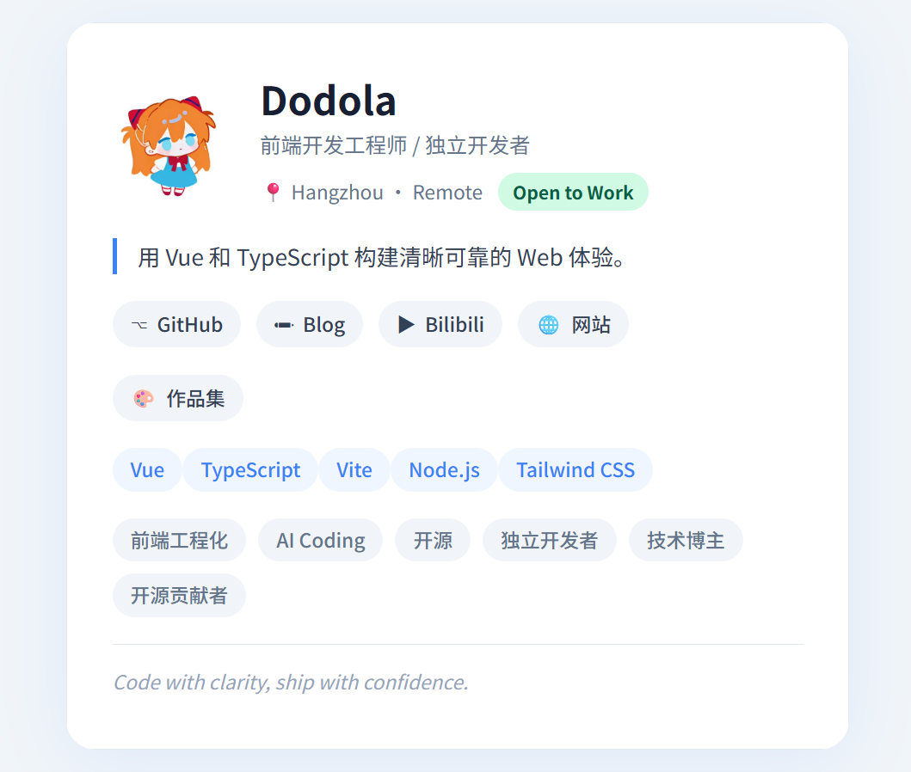
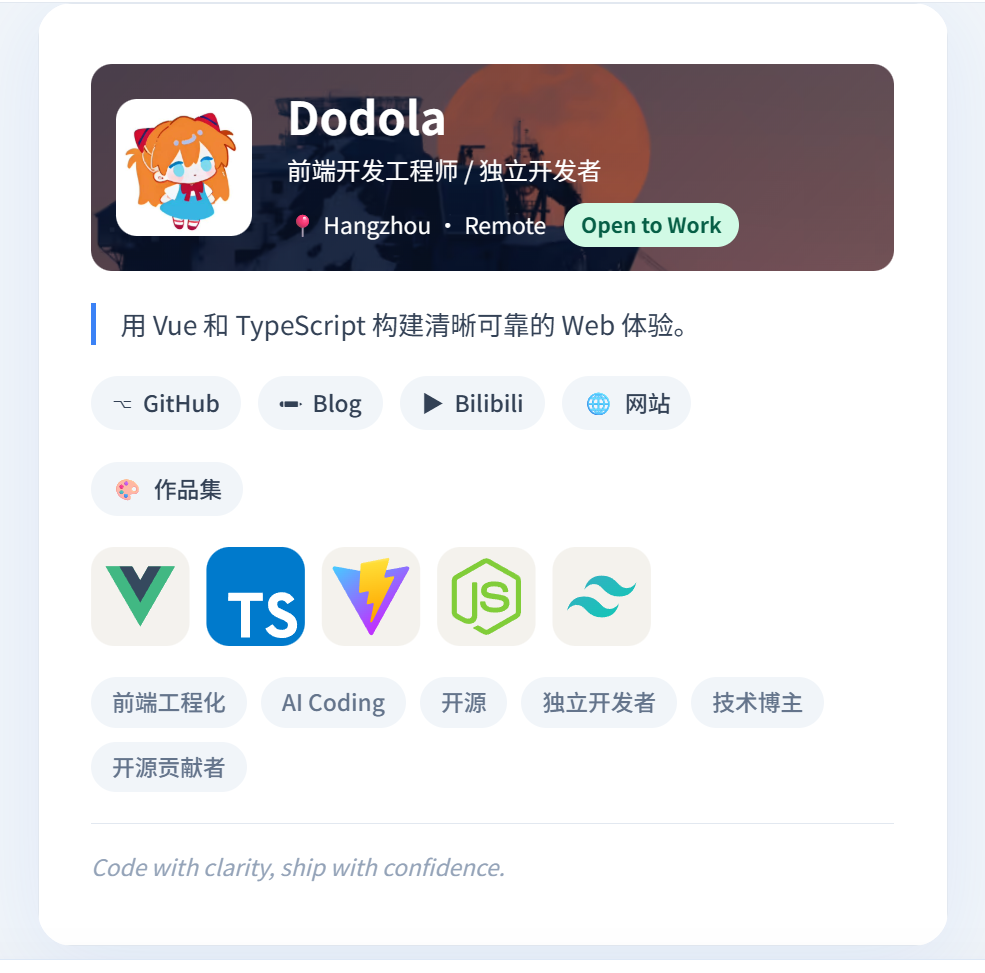
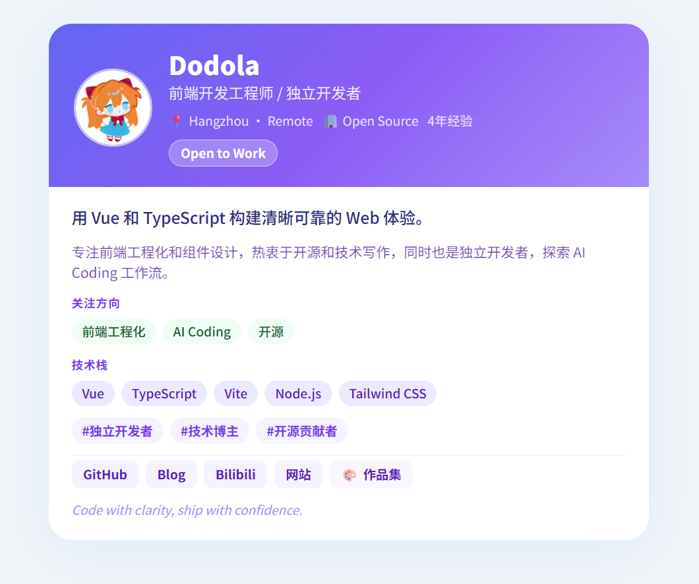
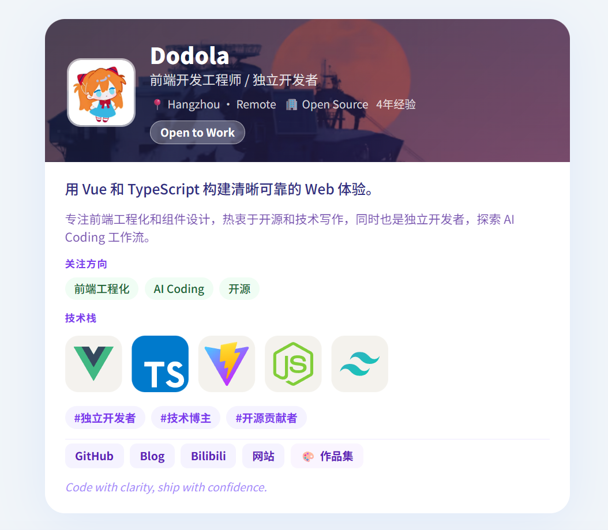

# livecard-studio

面向程序员的自我介绍卡片工作台。

在左侧通过结构化表单填写个人资料，右侧实时预览主题卡片效果，并一键导出为 HTML 或 PNG，3-5 分钟产出可分享的个人卡片。

---


## 卡片效果图

| 主题          | 标准效果                                          | 背景图覆盖效果                                                  |
| ------------- | ------------------------------------------------- | --------------------------------------------------------------- |
| Minimal Clean |  |  |
| DevFolio Soft |  |  |

---

## 核心能力

| 能力       | 说明                                  |
| ---------- | ------------------------------------- |
| 表单驱动   | 无需写代码，填写即所见                |
| 实时预览   | 数据变更立即同步到卡片                |
| 多主题     | 主题基于独立 Vue 组件，互不影响       |
| 多格式导出 | HTML（可离线打开）/ PNG（可配置倍率） |
| 本地持久化 | 数据自动保存到 localStorage           |

---

## 内置主题

- **Minimal Clean** — 简约可读，适合个人主页 About 区块
- **DevFolio Soft** — 技术感较强，信息密度更高，支持背景图覆盖模式

---

## 项目结构

```
src/
  types/
    profile-card.ts          # 统一数据类型 ProfileCardData
  data/
    default-profile-card.ts  # 默认示例数据
  features/
    profile-editor/          # 左侧表单（6 个 Tab 分区）
    export-card/             # 导出逻辑（HTML / PNG）
  pages/
    studio/                  # 工作台主页面
  themes/
    core/                    # 主题注册、类型、渲染器
    minimal-clean/           # 主题：Minimal Clean
    devfolio-soft/           # 主题：DevFolio Soft
    template/                # 新主题模板
scripts/
  export-bridge-server.mjs   # Playwright 高还原 PNG 导出桥接服务
```

> 主题通过 `import.meta.glob('@/themes/*/manifest.ts')` 自动发现，新增主题无需手动注册。

---

## 本地启动

```sh
pnpm install
pnpm dev
```

默认地址：`http://localhost:5173`

## 构建与校验

```sh
pnpm type-check   # TypeScript 类型检查
pnpm build        # 生产构建
pnpm lint         # oxlint + eslint
```

---

## 使用流程

1. 在左侧 6 个 Tab 依次填写：基础信息、头像简介、介绍、社交链接、技术栈、自定义链接。
2. 在预览区底部切换主题，选择适合自己的风格。
3. 在顶部导出面板选择倍率，点击 **HTML** 或 **PNG** 导出。

---

## 导出说明

### HTML

生成单文件页面，内嵌样式与数据快照，可离线打开。

### PNG（浏览器端）

直接对预览画布截图，使用 `html-to-image` 生成，支持 1x / 2x / 3x 缩放倍率。

### PNG（Playwright 高还原，可选）

若需要更高还原度，可启动本地桥接服务，由 Playwright 直接截图：

**1. 启动前端**

```sh
pnpm dev
# 默认：http://127.0.0.1:5173
```

**2. 启动桥接服务**

```sh
pnpm export:bridge
# 默认监听：http://127.0.0.1:3210/api/export/png
```

**可选环境变量**

| 变量                          | 说明                                | 默认值                                 |
| ----------------------------- | ----------------------------------- | -------------------------------------- |
| `LIVECARD_EXPORT_BRIDGE_PORT` | 桥接服务端口                        | `3210`                                 |
| `LIVECARD_EXPORT_TARGET_URL`  | Playwright 打开的前端地址           | `http://127.0.0.1:5173`                |
| `VITE_EXPORT_BRIDGE_URL`      | 前端请求桥接的地址（Vite 环境变量） | `http://127.0.0.1:3210/api/export/png` |
| `LIVECARD_EXPORT_TIMEOUT_MS`  | 导出超时时间（ms）                  | `45000`                                |

**常见问题**

- **"本地导出服务未启动"** — 运行 `pnpm export:bridge`
- **"目标页面不可访问"** — 前端实际端口与 `LIVECARD_EXPORT_TARGET_URL` 不一致，手动设置该变量
- **导出超时** — 背景图/头像外链响应慢，换用稳定图片地址或提升 `LIVECARD_EXPORT_TIMEOUT_MS`
- **连续点击偶发失败** — 桥接服务已串行化处理，等待前一个完成再操作

---

## 新增主题

1. 复制 `src/themes/template/` 下的模板文件。
2. 修改组件结构与视觉样式。
3. 在 `manifest.ts` 中声明 `id`、`name`、`supportedFields` 等元信息。
4. 无需手动注册，主题会被自动发现。

---

## 注意事项

- URL 字段支持自动补全 `https://` 协议前缀。
- 不同主题按自身布局使用字段，空字段自动降级隐藏。
- 数据持久化 key：`livecard-studio-profile-card-v1`。
